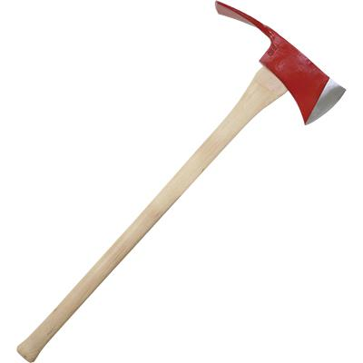

# pulaski

A script for scraping fire data from [NOAA's Hazard Mapping System Fire and Smoke Product](https://www.ospo.noaa.gov/Products/land/hms.html#data) and returning it as geojson

## To do

- add option for date range
- add code to default to current day
- add option to pretty print JSON

)